# Eaglehurst Backend Architecture Diagram

## 🏗️ Overall Architecture Overview

```mermaid
graph TB
    %% External Layer
    Client[Frontend Client<br/>React/Vite<br/>:5173]
    Admin[Admin Dashboard<br/>React Components]
    Mobile[Mobile App<br/>Future]
    
    %% API Gateway Layer
    subgraph "API Layer"
        FastAPI[FastAPI Application<br/>:8000]
        CORS[CORS Middleware]
        Auth[Auth Middleware]
        Validation[Request Validation]
        Docs[Auto-Generated Docs<br/>/docs]
    end
    
    %% Router Layer
    subgraph "API Routers (v1)"
        AuthRouter[Auth Router<br/>/auth]
        UserRouter[Users Router<br/>/users]
        ListingRouter[Listings Router<br/>/listings]
        ConnectionRouter[Connections Router<br/>/connections]
        SubRouter[Subscriptions Router<br/>/subscriptions]
        ServiceRouter[Services Router<br/>/services]
        NotifRouter[Notifications Router<br/>/notifications]
        AnalyticsRouter[Analytics Router<br/>/analytics]
        AdminRouter[Admin Router<br/>/admin]
    end
    
    %% Business Logic Layer
    subgraph "Business Logic Layer"
        AuthBL[AuthBusinessLogic<br/>Registration/Login/JWT]
        UserBL[UserBusinessLogic<br/>Profile Management]
        ListingBL[ListingBusinessLogic<br/>CRUD/Search/Analytics]
        ConnectionBL[ConnectionBusinessLogic<br/>Messaging/Requests]
        SubBL[SubscriptionBusinessLogic<br/>Plans/Payments]
        ServiceBL[ServiceBusinessLogic<br/>Legal/Valuation]
        NotifBL[NotificationBusinessLogic<br/>Email/Push/SMS]
        AnalyticsBL[AnalyticsBusinessLogic<br/>Metrics/Reports]
        AdminBL[AdminBusinessLogic<br/>User/Content Management]
    end
    
    %% Data Access Layer
    subgraph "Data Access Layer (DAO)"
        BaseDAO[BaseDAO<br/>Generic CRUD Operations]
        UserDAO[UserDAO<br/>User/Seller/Buyer Operations]
        ListingDAO[ListingDAO<br/>Listing/Media/Views Operations]
        ConnectionDAO[ConnectionDAO<br/>Messages/Connections]
        SubDAO[SubscriptionDAO<br/>Plans/Usage Tracking]
        ServiceDAO[ServiceDAO<br/>Requests/Communications]
        NotifDAO[NotificationDAO<br/>Templates/Preferences]
        AnalyticsDAO[AnalyticsDAO<br/>Metrics/Tracking]
    end
    
    %% Database Layer
    subgraph "Database Layer"
        MySQL[(MariaDB Database<br/>Remote Server<br/>37.220.31.46)]
        
        subgraph "Database Tables"
            UserTables[Users, Sellers, Buyers<br/>EmailVerifications, PasswordResets]
            ListingTables[Listings, ListingMedia<br/>ListingEdits, SavedListings]
            ConnectionTables[Connections, Messages<br/>MessageReads, ConnectionNotes]
            SubTables[Subscriptions, UserSubscriptions<br/>Payments, SubscriptionUsage]
            ServiceTables[ServiceRequests, ServiceCommunications<br/>ServiceDocuments, ServiceTemplates]
            NotifTables[Notifications, NotificationPreferences<br/>EmailTemplates, NotificationLogs]
            AnalyticsTables[ListingViews, ProfileViews<br/>SearchQueries, UserActivities<br/>PlatformMetrics, ConversionFunnel]
        end
    end
    
    %% Utility Layer
    subgraph "Utility Layer"
        AuthUtils[AuthUtils<br/>JWT/Password Hashing]
        FileHandler[FileHandler<br/>Upload/Storage/Thumbnails]
        EmailService[EmailService<br/>SMTP/Templates]
        Dependencies[Dependencies<br/>Auth/Permissions]
    end
    
    %% External Services
    subgraph "External Services"
        SMTP[SMTP Server<br/>Gmail/SendGrid]
        S3[AWS S3<br/>File Storage]
        Stripe[Stripe<br/>Payments]
        Redis[Redis<br/>Caching/Sessions]
    end
    
    %% Configuration
    subgraph "Configuration"
        Config[Settings<br/>Environment Variables]
        Constants[Constants<br/>Enums/Status Values]
        Types[Custom Types<br/>UUID/Schemas]
    end
    
    %% Connections
    Client --> FastAPI
    Admin --> FastAPI
    Mobile --> FastAPI
    
    FastAPI --> AuthRouter
    FastAPI --> UserRouter
    FastAPI --> ListingRouter
    FastAPI --> ConnectionRouter
    FastAPI --> SubRouter
    FastAPI --> ServiceRouter
    FastAPI --> NotifRouter
    FastAPI --> AnalyticsRouter
    FastAPI --> AdminRouter
    
    AuthRouter --> AuthBL
    UserRouter --> UserBL
    ListingRouter --> ListingBL
    ConnectionRouter --> ConnectionBL
    SubRouter --> SubBL
    ServiceRouter --> ServiceBL
    NotifRouter --> NotifBL
    AnalyticsRouter --> AnalyticsBL
    AdminRouter --> AdminBL
    
    AuthBL --> UserDAO
    UserBL --> UserDAO
    ListingBL --> ListingDAO
    ConnectionBL --> ConnectionDAO
    SubBL --> SubDAO
    ServiceBL --> ServiceDAO
    NotifBL --> NotifDAO
    AnalyticsBL --> AnalyticsDAO
    AdminBL --> BaseDAO
    
    UserDAO --> MySQL
    ListingDAO --> MySQL
    ConnectionDAO --> MySQL
    SubDAO --> MySQL
    ServiceDAO --> MySQL
    NotifDAO --> MySQL
    AnalyticsDAO --> MySQL
    BaseDAO --> MySQL
    
    MySQL --> UserTables
    MySQL --> ListingTables
    MySQL --> ConnectionTables
    MySQL --> SubTables
    MySQL --> ServiceTables
    MySQL --> NotifTables
    MySQL --> AnalyticsTables
    
    AuthBL --> AuthUtils
    ListingBL --> FileHandler
    NotifBL --> EmailService
    ServiceBL --> FileHandler
    
    EmailService --> SMTP
    FileHandler --> S3
    SubBL --> Stripe
    NotifBL --> Redis
    
    FastAPI --> Config
    AuthUtils --> Constants
    BaseDAO --> Types
    
    classDef client fill:#e1f5fe
    classDef api fill:#f3e5f5
    classDef router fill:#e8f5e8
    classDef business fill:#fff3e0
    classDef dao fill:#fce4ec
    classDef database fill:#e0f2f1
    classDef utility fill:#f1f8e9
    classDef external fill:#fafafa
    classDef config fill:#e8eaf6
    
    class Client,Admin,Mobile client
    class FastAPI,CORS,Auth,Validation,Docs api
    class AuthRouter,UserRouter,ListingRouter,ConnectionRouter,SubRouter,ServiceRouter,NotifRouter,AnalyticsRouter,AdminRouter router
    class AuthBL,UserBL,ListingBL,ConnectionBL,SubBL,ServiceBL,NotifBL,AnalyticsBL,AdminBL business
    class BaseDAO,UserDAO,ListingDAO,ConnectionDAO,SubDAO,ServiceDAO,NotifDAO,AnalyticsDAO dao
    class MySQL,UserTables,ListingTables,ConnectionTables,SubTables,ServiceTables,NotifTables,AnalyticsTables database
    class AuthUtils,FileHandler,EmailService,Dependencies utility
    class SMTP,S3,Stripe,Redis external
    class Config,Constants,Types config
```



## 📋 Layer-by-Layer Breakdown

### 1. **API Layer (FastAPI)**
- **FastAPI Application**: Main application server running on port 8000
- **Middleware Stack**:
  - CORS Middleware (development: allow all, production: specific origins)
  - Authentication Middleware
  - Request Validation
  - Trusted Host Middleware
- **Auto-Generated Documentation**: `/docs` and `/redoc` endpoints

### 2. **Router Layer (API v1)**
```
/api/v1/
├── /auth          # Authentication (login, register, verify)
├── /users         # User profile management
├── /listings      # Medical business listings CRUD
├── /connections   # Buyer-seller connections & messaging
├── /subscriptions # Subscription plans & payments
├── /services      # Legal & valuation services
├── /notifications # Email, push, SMS notifications
├── /analytics     # User & platform analytics
└── /admin         # Admin management endpoints
```

### 3. **Business Logic Layer**
- **AuthBusinessLogic**: User registration, login, JWT management, email verification
- **ListingBusinessLogic**: Listing CRUD, search, filtering, analytics, media management
- **ConnectionBusinessLogic**: Connection requests, messaging, buyer-seller interactions
- **UserBusinessLogic**: Profile management, verification, preferences
- **SubscriptionBusinessLogic**: Plan management, payment processing, usage tracking
- **ServiceBusinessLogic**: Legal/valuation service requests, communications
- **NotificationBusinessLogic**: Email templates, push notifications, preferences
- **AnalyticsBusinessLogic**: Platform metrics, user analytics, conversion tracking
- **AdminBusinessLogic**: User management, content moderation, system administration

### 4. **Data Access Layer (DAO)**
- **BaseDAO**: Generic CRUD operations with pagination, filtering, sorting
- **Specialized DAOs**: Domain-specific database operations
- **Query Optimization**: Efficient database queries with proper indexing
- **Transaction Management**: Atomic operations and rollback support

### 5. **Database Layer (MySQL on AWS RDS)**

#### **Core Tables:**
```sql
-- User Management
users, sellers, buyers, email_verifications, password_resets

-- Listings & Media
listings, listing_media, listing_edits, saved_listings

-- Connections & Messaging
connections, messages, message_reads, connection_notes

-- Subscriptions & Payments
subscriptions, user_subscriptions, payments, subscription_usage

-- Services
service_requests, service_communications, service_documents, 
service_templates, service_providers

-- Notifications
notifications, notification_preferences, email_templates, 
notification_logs, push_devices

-- Analytics
listing_views, profile_views, search_queries, user_activities,
platform_metrics, conversion_funnel
```

### 6. **Utility Layer**
- **AuthUtils**: JWT token management, password hashing (bcrypt)
- **FileHandler**: File uploads, image processing, thumbnail generation
- **EmailService**: SMTP email sending with templates
- **Dependencies**: Authentication decorators, permission checking

### 7. **External Services Integration**
- **MySQL Database**: AWS RDS for persistent data storage
- **SMTP Server**: Gmail/SendGrid for email delivery
- **AWS S3**: File storage for images and documents
- **Stripe**: Payment processing for subscriptions
- **Redis**: Caching and session management

### 8. **Configuration Management**
- **Environment Variables**: Database URLs, API keys, secrets
- **Settings Class**: Pydantic-based configuration with validation
- **Constants**: Enums for status values, user types, etc.
- **Custom Types**: UUID handling, schema definitions

## 🔐 Security Features

### **Authentication & Authorization**
```python
# JWT-based authentication
@router.get("/protected")
async def protected_route(
    current_user: User = Depends(get_current_verified_user)
):
    return {"user": current_user}

# Role-based access control
@router.post("/admin-only")
async def admin_only(
    current_admin: User = Depends(get_current_admin)
):
    return {"message": "Admin access granted"}

# Permission-based access
@router.put("/listings/{listing_id}")
async def update_listing(
    listing_id: UUID,
    current_seller: User = Depends(get_current_seller)
):
    # Only listing owner can update
    pass
```

### **Data Validation**
- Pydantic schemas for request/response validation
- UUID validation for all ID parameters
- Email format validation
- Password strength requirements
- File type and size validation

### **Security Middleware**
- CORS configuration (development vs production)
- Trusted host middleware
- Rate limiting (configurable)
- Request size limits

## 🚀 Performance Features

### **Database Optimization**
- Connection pooling with SQLAlchemy
- Lazy loading for relationships
- Indexed columns for fast queries
- Pagination for large datasets

### **Caching Strategy**
- Redis for session storage
- Query result caching
- File metadata caching

### **Async Operations**
- Async/await for I/O operations
- Background tasks for email sending
- Non-blocking file uploads

## 📊 Monitoring & Analytics

### **Built-in Analytics**
- User activity tracking
- Listing view analytics
- Search query analytics
- Conversion funnel tracking
- Platform metrics dashboard

### **Logging**
- Structured logging with Python logging
- Database query logging
- Error tracking and reporting
- Performance monitoring

## 🔄 Data Flow Example

### **User Registration Flow**
```
1. POST /api/v1/auth/register
2. AuthRouter → AuthBusinessLogic
3. AuthBL → UserDAO (check existing email)
4. AuthBL → AuthUtils (hash password)
5. UserDAO → MySQL (create user record)
6. AuthBL → EmailService (send verification email)
7. EmailService → SMTP (deliver email)
8. Return success response with user data
```

### **Listing Creation Flow**
```
1. POST /api/v1/listings/
2. ListingRouter → ListingBusinessLogic
3. ListingBL → Dependencies (verify seller auth)
4. ListingBL → ListingDAO (create listing)
5. ListingDAO → MySQL (insert listing record)
6. ListingBL → FileHandler (process images)
7. FileHandler → S3 (upload files)
8. Return created listing with media URLs
```

This architecture provides a scalable, maintainable, and secure foundation for the Eaglehurst medical business marketplace platform.
