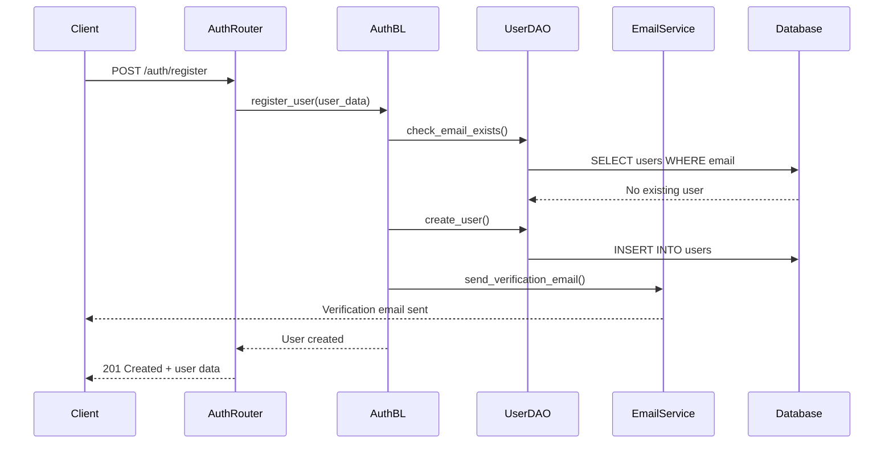
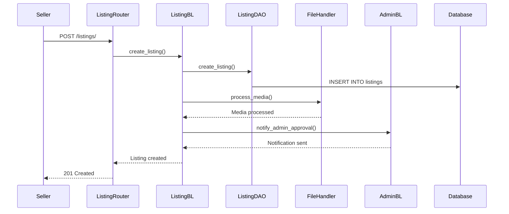
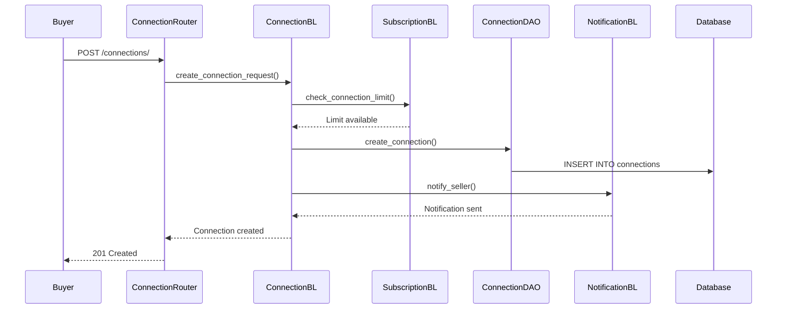
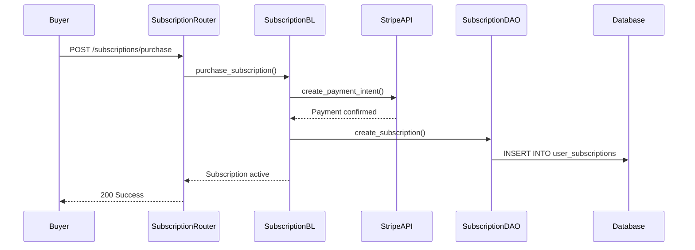

# 🏗️ Eaglehurst Backend - Comprehensive Design & Implementation

## 🎯 System Overview

```mermaid
graph TB
    %% External Clients
    subgraph "Client Applications"
        WebApp[Web Application<br/>React + TypeScript<br/>:5173]
        MobileApp[Mobile Application<br/>React Native<br/>Future]
        AdminPanel[Admin Dashboard<br/>React Components]
        ThirdParty[Third-party Integrations<br/>API Consumers]
    end
    
    %% Load Balancer & Gateway
    subgraph "Entry Point"
        LoadBalancer[Load Balancer<br/>Nginx/AWS ALB]
        APIGateway[API Gateway<br/>Rate Limiting & Routing]
    end
    
    %% FastAPI Application
    subgraph "FastAPI Application Layer"
        FastAPI[FastAPI Server<br/>:8000<br/>Uvicorn ASGI]
        
        subgraph "Middleware Stack"
            CORSMid[CORS Middleware<br/>Cross-Origin Requests]
            AuthMid[Authentication Middleware<br/>JWT Validation]
            ValidationMid[Request Validation<br/>Pydantic Schemas]
            LoggingMid[Logging Middleware<br/>Request/Response Tracking]
            RateLimitMid[Rate Limiting<br/>Per-User/IP Limits]
        end
        
        subgraph "Exception Handlers"
            ValidationHandler[Validation Error Handler<br/>422 Responses]
            HTTPHandler[HTTP Exception Handler<br/>4xx/5xx Responses]
            GeneralHandler[General Exception Handler<br/>500 Responses]
        end
    end
    
    %% API Router Layer
    subgraph "API Router Layer (/api/v1/)"
        AuthRouter[🔐 Auth Router<br/>/auth<br/>Login, Register, Verify]
        UserRouter[👤 Users Router<br/>/users<br/>Profile Management]
        ListingRouter[🏢 Listings Router<br/>/listings<br/>Business Listings CRUD]
        ConnectionRouter[🤝 Connections Router<br/>/connections<br/>Buyer-Seller Messaging]
        SubscriptionRouter[💳 Subscriptions Router<br/>/subscriptions<br/>Plans & Payments]
        ServiceRouter[⚖️ Services Router<br/>/services<br/>Legal & Valuation]
        NotificationRouter[🔔 Notifications Router<br/>/notifications<br/>Email & Push]
        AnalyticsRouter[📊 Analytics Router<br/>/analytics<br/>User Analytics]
        AdminRouter[👑 Admin Router<br/>/admin<br/>System Management]
    end
    
    %% Business Logic Layer
    subgraph "Business Logic Layer"
        AuthBL[🔐 AuthBusinessLogic<br/>• User Registration<br/>• Login/Logout<br/>• JWT Management<br/>• Email Verification<br/>• Password Reset<br/>• OTP Generation]
        
        UserBL[👤 UserBusinessLogic<br/>• Profile Management<br/>• Seller/Buyer Profiles<br/>• KYC Verification<br/>• Account Settings<br/>• User Analytics]
        
        ListingBL[🏢 ListingBusinessLogic<br/>• Listing CRUD<br/>• Search & Filtering<br/>• Media Management<br/>• View Tracking<br/>• Approval Workflow<br/>• Analytics]
        
        ConnectionBL[🤝 ConnectionBusinessLogic<br/>• Connection Requests<br/>• Message Threading<br/>• Status Management<br/>• Notification Triggers<br/>• Blocking/Reporting]
        
        SubscriptionBL[💳 SubscriptionBusinessLogic<br/>• Plan Management<br/>• Payment Processing<br/>• Usage Tracking<br/>• Billing Cycles<br/>• Stripe Integration]
        
        ServiceBL[⚖️ ServiceBusinessLogic<br/>• Service Requests<br/>• Provider Matching<br/>• Communication Flow<br/>• Document Management<br/>• Status Tracking]
        
        NotificationBL[🔔 NotificationBusinessLogic<br/>• Email Templates<br/>• Push Notifications<br/>• SMS Integration<br/>• Preference Management<br/>• Delivery Tracking]
        
        AnalyticsBL[📊 AnalyticsBusinessLogic<br/>• User Analytics<br/>• Platform Metrics<br/>• Conversion Tracking<br/>• Report Generation<br/>• Data Aggregation]
        
        AdminBL[👑 AdminBusinessLogic<br/>• User Management<br/>• Content Moderation<br/>• System Monitoring<br/>• Analytics Dashboard<br/>• Configuration]
    end
    
    %% Data Access Layer
    subgraph "Data Access Layer (DAO Pattern)"
        BaseDAO[🏗️ BaseDAO<br/>Generic CRUD Operations<br/>• get(), create(), update(), delete()<br/>• Pagination & Filtering<br/>• Bulk Operations<br/>• Transaction Management]
        
        UserDAO[👤 UserDAO<br/>• User CRUD<br/>• Authentication<br/>• Profile Management<br/>• Verification Status]
        
        SellerDAO[🏪 SellerDAO<br/>• Seller Profiles<br/>• Business Details<br/>• Verification<br/>• Analytics]
        
        BuyerDAO[🛒 BuyerDAO<br/>• Buyer Profiles<br/>• Preferences<br/>• Subscription Status<br/>• Activity Tracking]
        
        ListingDAO[🏢 ListingDAO<br/>• Listing CRUD<br/>• Search Queries<br/>• Status Management<br/>• View Tracking]
        
        ConnectionDAO[🤝 ConnectionDAO<br/>• Connection Management<br/>• Message Storage<br/>• Status Updates<br/>• Thread Management]
        
        SubscriptionDAO[💳 SubscriptionDAO<br/>• Plan Management<br/>• User Subscriptions<br/>• Payment Records<br/>• Usage Tracking]
        
        ServiceDAO[⚖️ ServiceDAO<br/>• Service Requests<br/>• Provider Management<br/>• Communication Logs<br/>• Document Storage]
        
        NotificationDAO[🔔 NotificationDAO<br/>• Notification Storage<br/>• Template Management<br/>• Delivery Logs<br/>• Preferences]
        
        AnalyticsDAO[📊 AnalyticsDAO<br/>• Metrics Collection<br/>• Event Tracking<br/>• Report Queries<br/>• Data Aggregation]
    end
    
    %% Database Layer
    subgraph "Database Layer (MariaDB Remote Server)"
        MySQL[(🗄️ MariaDB Database<br/>37.220.31.46<br/>Port: 3306)]
        
        subgraph "User Management Tables"
            UsersTable[👤 users<br/>• id, email, password_hash<br/>• user_type, verification<br/>• timestamps]
            SellersTable[🏪 sellers<br/>• user_id, business_name<br/>• verification_status<br/>• business_details]
            BuyersTable[🛒 buyers<br/>• user_id, preferences<br/>• subscription_id<br/>• verification_status]
            EmailVerTable[📧 email_verifications<br/>• user_id, otp_code<br/>• expires_at, is_used]
            PasswordResetTable[🔑 password_resets<br/>• user_id, reset_token<br/>• expires_at, is_used]
        end
        
        subgraph "Listing Management Tables"
            ListingsTable[🏢 listings<br/>• id, seller_id, title<br/>• business_type, location<br/>• asking_price, status]
            ListingMediaTable[📸 listing_media<br/>• listing_id, file_path<br/>• media_type, order]
            ListingEditsTable[✏️ listing_edits<br/>• listing_id, field_name<br/>• old_value, new_value]
            SavedListingsTable[⭐ saved_listings<br/>• buyer_id, listing_id<br/>• notes, created_at]
        end
        
        subgraph "Connection & Messaging Tables"
            ConnectionsTable[🤝 connections<br/>• id, buyer_id, seller_id<br/>• listing_id, status<br/>• created_at]
            MessagesTable[💬 messages<br/>• connection_id, sender_id<br/>• content, message_type<br/>• is_read, created_at]
            MessageReadsTable[👁️ message_reads<br/>• message_id, user_id<br/>• read_at]
            ConnectionNotesTable[📝 connection_notes<br/>• connection_id, user_id<br/>• notes, created_at]
        end
        
        subgraph "Subscription & Payment Tables"
            SubscriptionsTable[💳 subscriptions<br/>• id, name, price<br/>• features, billing_cycle]
            UserSubscriptionsTable[👤💳 user_subscriptions<br/>• user_id, subscription_id<br/>• status, expires_at]
            PaymentsTable[💰 payments<br/>• user_id, amount<br/>• stripe_payment_id<br/>• status, created_at]
            SubscriptionUsageTable[📊 subscription_usage<br/>• user_subscription_id<br/>• connections_used<br/>• listings_used]
        end
        
        subgraph "Service Management Tables"
            ServiceRequestsTable[⚖️ service_requests<br/>• id, user_id, service_type<br/>• title, description<br/>• status, urgency]
            ServiceCommunicationsTable[💬 service_communications<br/>• service_request_id<br/>• sender_type, message<br/>• created_at]
            ServiceDocumentsTable[📄 service_documents<br/>• service_request_id<br/>• file_path, document_type]
            ServiceTemplatesTable[📋 service_templates<br/>• template_name, content<br/>• service_type]
            ServiceProvidersTable[🏛️ service_providers<br/>• company_name, services<br/>• contact_info, rating]
        end
        
        subgraph "Notification Tables"
            NotificationsTable[🔔 notifications<br/>• user_id, type, title<br/>• message, is_read<br/>• action_url, created_at]
            NotificationPreferencesTable[⚙️ notification_preferences<br/>• user_id, email_enabled<br/>• push_enabled, sms_enabled]
            EmailTemplatesTable[📧 email_templates<br/>• template_name, subject<br/>• html_content, variables]
            NotificationLogsTable[📋 notification_logs<br/>• notification_id<br/>• delivery_status<br/>• delivered_at]
            PushDevicesTable[📱 push_devices<br/>• user_id, device_token<br/>• platform, is_active]
        end
        
        subgraph "Analytics Tables"
            ListingViewsTable[👁️ listing_views<br/>• listing_id, viewer_id<br/>• ip_address, user_agent<br/>• viewed_at]
            ProfileViewsTable[👤👁️ profile_views<br/>• profile_id, viewer_id<br/>• viewed_at]
            SearchQueriesTable[🔍 search_queries<br/>• user_id, query_text<br/>• filters, results_count<br/>• searched_at]
            UserActivitiesTable[📊 user_activities<br/>• user_id, activity_type<br/>• metadata, created_at]
            PlatformMetricsTable[📈 platform_metrics<br/>• metric_name, value<br/>• date, category]
            ConversionFunnelTable[🎯 conversion_funnel<br/>• user_id, step_name<br/>• completed_at]
        end
    end
    
    %% Utility Services
    subgraph "Utility Services"
        AuthUtils[🔐 AuthUtils<br/>• JWT Token Management<br/>• Password Hashing (bcrypt)<br/>• Token Validation<br/>• Refresh Token Logic]
        
        FileHandler[📁 FileHandler<br/>• File Upload Processing<br/>• Image Resizing/Thumbnails<br/>• File Type Validation<br/>• Storage Management]
        
        EmailService[📧 EmailService<br/>• SMTP Configuration<br/>• Template Processing<br/>• Bulk Email Sending<br/>• Delivery Tracking]
        
        Dependencies[🔗 Dependencies<br/>• Authentication Decorators<br/>• Permission Checking<br/>• Role-based Access<br/>• Request Validation]
        
        ValidationService[✅ ValidationService<br/>• Data Validation<br/>• Business Rules<br/>• Schema Validation<br/>• Custom Validators]
    end
    
    %% External Services
    subgraph "External Services & Infrastructure"
        AWSRDS[🗄️ AWS RDS MySQL<br/>Database Hosting<br/>Automated Backups<br/>High Availability]
        
        AWSS3[☁️ AWS S3<br/>File Storage<br/>Image/Document Storage<br/>CDN Integration]
        
        StripeAPI[💳 Stripe API<br/>Payment Processing<br/>Subscription Management<br/>Webhook Handling]
        
        SMTPServer[📧 SMTP Server<br/>Gmail/SendGrid<br/>Email Delivery<br/>Bounce Handling]
        
        RedisCache[⚡ Redis Cache<br/>Session Storage<br/>Rate Limiting<br/>Temporary Data]
        
        CloudWatch[📊 AWS CloudWatch<br/>Monitoring & Logging<br/>Metrics Collection<br/>Alerting]
    end
    
    %% Configuration Management
    subgraph "Configuration & Constants"
        Settings[⚙️ Settings<br/>Environment Variables<br/>Database URLs<br/>API Keys & Secrets<br/>Feature Flags]
        
        Constants[📋 Constants<br/>Enums & Status Values<br/>Business Rules<br/>Default Values<br/>Error Messages]
        
        Types[🏷️ Custom Types<br/>UUID Handling<br/>Pydantic Models<br/>Response Schemas<br/>Validation Rules]
    end
    
    %% Connections - Client to API
    WebApp --> LoadBalancer
    MobileApp --> LoadBalancer
    AdminPanel --> LoadBalancer
    ThirdParty --> LoadBalancer
    
    LoadBalancer --> APIGateway
    APIGateway --> FastAPI
    
    %% Middleware Flow
    FastAPI --> CORSMid
    CORSMid --> AuthMid
    AuthMid --> ValidationMid
    ValidationMid --> LoggingMid
    LoggingMid --> RateLimitMid
    
    %% Exception Handling
    FastAPI --> ValidationHandler
    FastAPI --> HTTPHandler
    FastAPI --> GeneralHandler
    
    %% Router Connections
    FastAPI --> AuthRouter
    FastAPI --> UserRouter
    FastAPI --> ListingRouter
    FastAPI --> ConnectionRouter
    FastAPI --> SubscriptionRouter
    FastAPI --> ServiceRouter
    FastAPI --> NotificationRouter
    FastAPI --> AnalyticsRouter
    FastAPI --> AdminRouter
    
    %% Business Logic Connections
    AuthRouter --> AuthBL
    UserRouter --> UserBL
    ListingRouter --> ListingBL
    ConnectionRouter --> ConnectionBL
    SubscriptionRouter --> SubscriptionBL
    ServiceRouter --> ServiceBL
    NotificationRouter --> NotificationBL
    AnalyticsRouter --> AnalyticsBL
    AdminRouter --> AdminBL
    
    %% DAO Connections
    AuthBL --> UserDAO
    UserBL --> UserDAO
    UserBL --> SellerDAO
    UserBL --> BuyerDAO
    ListingBL --> ListingDAO
    ConnectionBL --> ConnectionDAO
    SubscriptionBL --> SubscriptionDAO
    ServiceBL --> ServiceDAO
    NotificationBL --> NotificationDAO
    AnalyticsBL --> AnalyticsDAO
    AdminBL --> BaseDAO
    
    %% Database Connections
    UserDAO --> MySQL
    SellerDAO --> MySQL
    BuyerDAO --> MySQL
    ListingDAO --> MySQL
    ConnectionDAO --> MySQL
    SubscriptionDAO --> MySQL
    ServiceDAO --> MySQL
    NotificationDAO --> MySQL
    AnalyticsDAO --> MySQL
    BaseDAO --> MySQL
    
    %% Table Relationships
    MySQL --> UsersTable
    MySQL --> SellersTable
    MySQL --> BuyersTable
    MySQL --> EmailVerTable
    MySQL --> PasswordResetTable
    MySQL --> ListingsTable
    MySQL --> ListingMediaTable
    MySQL --> ListingEditsTable
    MySQL --> SavedListingsTable
    MySQL --> ConnectionsTable
    MySQL --> MessagesTable
    MySQL --> MessageReadsTable
    MySQL --> ConnectionNotesTable
    MySQL --> SubscriptionsTable
    MySQL --> UserSubscriptionsTable
    MySQL --> PaymentsTable
    MySQL --> SubscriptionUsageTable
    MySQL --> ServiceRequestsTable
    MySQL --> ServiceCommunicationsTable
    MySQL --> ServiceDocumentsTable
    MySQL --> ServiceTemplatesTable
    MySQL --> ServiceProvidersTable
    MySQL --> NotificationsTable
    MySQL --> NotificationPreferencesTable
    MySQL --> EmailTemplatesTable
    MySQL --> NotificationLogsTable
    MySQL --> PushDevicesTable
    MySQL --> ListingViewsTable
    MySQL --> ProfileViewsTable
    MySQL --> SearchQueriesTable
    MySQL --> UserActivitiesTable
    MySQL --> PlatformMetricsTable
    MySQL --> ConversionFunnelTable
    
    %% Utility Connections
    AuthBL --> AuthUtils
    ListingBL --> FileHandler
    ServiceBL --> FileHandler
    NotificationBL --> EmailService
    AuthRouter --> Dependencies
    UserRouter --> Dependencies
    ListingRouter --> Dependencies
    ConnectionRouter --> Dependencies
    SubscriptionRouter --> Dependencies
    ServiceRouter --> Dependencies
    NotificationRouter --> Dependencies
    AnalyticsRouter --> Dependencies
    AdminRouter --> Dependencies
    
    %% External Service Connections
    MySQL --> AWSRDS
    FileHandler --> AWSS3
    SubscriptionBL --> StripeAPI
    EmailService --> SMTPServer
    NotificationBL --> RedisCache
    FastAPI --> CloudWatch
    
    %% Configuration Connections
    FastAPI --> Settings
    AuthUtils --> Constants
    BaseDAO --> Types
    ValidationService --> Types
    
    %% Styling
    classDef client fill:#e3f2fd,stroke:#1976d2,stroke-width:2px
    classDef entry fill:#f3e5f5,stroke:#7b1fa2,stroke-width:2px
    classDef api fill:#e8f5e8,stroke:#388e3c,stroke-width:2px
    classDef middleware fill:#fff3e0,stroke:#f57c00,stroke-width:2px
    classDef router fill:#e1f5fe,stroke:#0277bd,stroke-width:2px
    classDef business fill:#fce4ec,stroke:#c2185b,stroke-width:2px
    classDef dao fill:#f1f8e9,stroke:#689f38,stroke-width:2px
    classDef database fill:#e0f2f1,stroke:#00695c,stroke-width:2px
    classDef tables fill:#e8eaf6,stroke:#3f51b5,stroke-width:2px
    classDef utility fill:#fff8e1,stroke:#ff8f00,stroke-width:2px
    classDef external fill:#fafafa,stroke:#616161,stroke-width:2px
    classDef config fill:#f9fbe7,stroke:#827717,stroke-width:2px
    
    class WebApp,MobileApp,AdminPanel,ThirdParty client
    class LoadBalancer,APIGateway entry
    class FastAPI api
    class CORSMid,AuthMid,ValidationMid,LoggingMid,RateLimitMid,ValidationHandler,HTTPHandler,GeneralHandler middleware
    class AuthRouter,UserRouter,ListingRouter,ConnectionRouter,SubscriptionRouter,ServiceRouter,NotificationRouter,AnalyticsRouter,AdminRouter router
    class AuthBL,UserBL,ListingBL,ConnectionBL,SubscriptionBL,ServiceBL,NotificationBL,AnalyticsBL,AdminBL business
    class BaseDAO,UserDAO,SellerDAO,BuyerDAO,ListingDAO,ConnectionDAO,SubscriptionDAO,ServiceDAO,NotificationDAO,AnalyticsDAO dao
    class MySQL database
    class UsersTable,SellersTable,BuyersTable,EmailVerTable,PasswordResetTable,ListingsTable,ListingMediaTable,ListingEditsTable,SavedListingsTable,ConnectionsTable,MessagesTable,MessageReadsTable,ConnectionNotesTable,SubscriptionsTable,UserSubscriptionsTable,PaymentsTable,SubscriptionUsageTable,ServiceRequestsTable,ServiceCommunicationsTable,ServiceDocumentsTable,ServiceTemplatesTable,ServiceProvidersTable,NotificationsTable,NotificationPreferencesTable,EmailTemplatesTable,NotificationLogsTable,PushDevicesTable,ListingViewsTable,ProfileViewsTable,SearchQueriesTable,UserActivitiesTable,PlatformMetricsTable,ConversionFunnelTable tables
    class AuthUtils,FileHandler,EmailService,Dependencies,ValidationService utility
    class AWSRDS,AWSS3,StripeAPI,SMTPServer,RedisCache,CloudWatch external
    class Settings,Constants,Types config
```

## 📋 Complete API Endpoint Mapping

### 🔐 Authentication Endpoints (`/api/v1/auth`)
```
POST   /register              # User registration
POST   /login                 # User login
POST   /logout                # User logout
POST   /refresh               # Refresh JWT token
POST   /verify-email          # Email verification
POST   /resend-otp            # Resend OTP
POST   /forgot-password       # Password reset request
POST   /reset-password        # Password reset confirmation
GET    /me                    # Get current user info
```

### 👤 User Management (`/api/v1/users`)
```
GET    /profile               # Get user profile
PUT    /profile               # Update user profile
POST   /upload-avatar         # Upload profile picture
GET    /seller/profile        # Get seller profile
PUT    /seller/profile        # Update seller profile
GET    /buyer/profile         # Get buyer profile
PUT    /buyer/profile         # Update buyer profile
POST   /kyc-upload            # Upload KYC documents
GET    /verification-status   # Check verification status
```

### 🏢 Listings Management (`/api/v1/listings`)
```
GET    /                      # Browse all listings (with filters)
POST   /                      # Create new listing
GET    /{listing_id}          # Get listing details
PUT    /{listing_id}          # Update listing
DELETE /{listing_id}          # Delete listing
POST   /{listing_id}/media    # Upload listing media
DELETE /{listing_id}/media/{media_id}  # Delete media
GET    /seller/my-listings    # Get seller's listings
POST   /{listing_id}/save     # Save listing (buyers)
DELETE /{listing_id}/save     # Unsave listing
GET    /saved                 # Get saved listings
GET    /{listing_id}/analytics # Get listing analytics
```

### 🤝 Connections & Messaging (`/api/v1/connections`)
```
GET    /                      # Get user connections
POST   /                      # Create connection request
GET    /{connection_id}       # Get connection details
PUT    /{connection_id}/respond # Respond to connection
POST   /{connection_id}/messages # Send message
GET    /{connection_id}/messages # Get messages
PUT    /{connection_id}/messages/{message_id}/read # Mark as read
PUT    /{connection_id}/block  # Block connection
GET    /buyer/requests        # Get buyer's requests
GET    /seller/requests       # Get seller's requests
```

### 💳 Subscriptions & Payments (`/api/v1/subscriptions`)
```
GET    /plans                 # Get subscription plans
GET    /current               # Get current subscription
POST   /purchase              # Purchase subscription
PUT    /cancel                # Cancel subscription
GET    /usage                 # Get usage statistics
POST   /payment-methods       # Add payment method
GET    /payment-methods       # Get payment methods
DELETE /payment-methods/{id}  # Delete payment method
GET    /invoices              # Get billing history
```

### ⚖️ Services (`/api/v1/services`)
```
GET    /                      # Get user service requests
POST   /                      # Create service request
GET    /{request_id}          # Get service request details
PUT    /{request_id}          # Update service request
POST   /{request_id}/communications # Add communication
GET    /{request_id}/communications # Get communications
POST   /{request_id}/documents # Upload documents
GET    /{request_id}/documents # Get documents
GET    /providers             # Get service providers
GET    /templates             # Get service templates
```

### 🔔 Notifications (`/api/v1/notifications`)
```
GET    /                      # Get notifications
PUT    /{notification_id}/read # Mark as read
PUT    /mark-all-read         # Mark all as read
GET    /preferences           # Get notification preferences
PUT    /preferences           # Update preferences
POST   /devices               # Register push device
DELETE /devices/{device_id}   # Unregister device
```

### 📊 Analytics (`/api/v1/analytics`)
```
GET    /dashboard             # User analytics dashboard
GET    /seller/listings       # Seller listing analytics
GET    /buyer/activity        # Buyer activity analytics
GET    /connections           # Connection analytics
GET    /revenue               # Revenue analytics (sellers)
```

### 👑 Admin Management (`/api/v1/admin`)
```
GET    /dashboard             # Admin dashboard
GET    /users                 # User management
PUT    /users/{user_id}/verify # Verify user
PUT    /users/{user_id}/suspend # Suspend user
GET    /listings              # Listing management
PUT    /listings/{id}/approve # Approve listing
PUT    /listings/{id}/reject  # Reject listing
GET    /analytics/platform    # Platform analytics
GET    /analytics/revenue     # Revenue analytics
GET    /analytics/users       # User analytics
GET    /service-requests      # Service request management
GET    /system/health         # System health check
```

## 🔄 Key Business Flows

### 1. **User Registration & Verification Flow**


### 2. **Listing Creation & Approval Flow**


### 3. **Connection Request Flow**


### 4. **Payment Processing Flow**


## 🛡️ Security Implementation

### **Authentication & Authorization**
```python
# JWT-based authentication with role checking
@router.get("/protected-endpoint")
async def protected_endpoint(
    current_user: User = Depends(get_current_verified_user)
):
    return {"user": current_user}

# Role-based access control
@router.post("/seller-only")
async def seller_only_endpoint(
    current_seller: User = Depends(get_current_seller)
):
    return {"message": "Seller access granted"}

# Permission-based access
@router.put("/listings/{listing_id}")
async def update_listing(
    listing_id: UUID,
    listing_data: ListingUpdate,
    current_user: User = Depends(get_current_user),
    db: Session = Depends(get_db)
):
    # Verify listing ownership
    listing = db.query(Listing).filter(Listing.id == listing_id).first()
    if listing.seller_id != current_user.id:
        raise HTTPException(403, "Not authorized")
```

### **Data Validation & Sanitization**
```python
# Pydantic schemas for validation
class UserCreate(BaseModel):
    email: EmailStr
    password: str = Field(..., min_length=8, regex=r"^(?=.*[a-z])(?=.*[A-Z])(?=.*\d)")
    user_type: UserType
    first_name: str = Field(..., min_length=1, max_length=50)
    last_name: str = Field(..., min_length=1, max_length=50)
    phone: Optional[str] = Field(None, regex=r"^\+?1?\d{9,15}$")

# UUID validation for all ID parameters
@router.get("/listings/{listing_id}")
async def get_listing(listing_id: UUID):  # Automatic UUID validation
    pass
```

### **Rate Limiting & Security Headers**
```python
# Rate limiting middleware
@app.middleware("http")
async def rate_limit_middleware(request: Request, call_next):
    # Implement rate limiting logic
    pass

# Security headers
@app.middleware("http")
async def security_headers(request: Request, call_next):
    response = await call_next(request)
    response.headers["X-Content-Type-Options"] = "nosniff"
    response.headers["X-Frame-Options"] = "DENY"
    response.headers["X-XSS-Protection"] = "1; mode=block"
    return response
```

## 🚀 Performance Optimizations

### **Database Optimizations**
- **Connection Pooling**: SQLAlchemy connection pool management
- **Query Optimization**: Indexed columns, efficient joins
- **Lazy Loading**: Relationships loaded on demand
- **Pagination**: All list endpoints support pagination
- **Caching**: Redis for frequently accessed data

### **Async Operations**
```python
# Async business logic methods
async def create_listing(self, seller: User, listing_data: ListingCreate):
    # Non-blocking database operations
    listing = await self.listing_dao.create_async(listing_data)
    
    # Background tasks for heavy operations
    background_tasks.add_task(process_listing_images, listing.id)
    background_tasks.add_task(send_admin_notification, listing.id)
    
    return listing
```

### **File Handling**
```python
# Efficient file processing
class FileHandler:
    async def process_upload(self, file: UploadFile):
        # Async file processing
        # Image resizing and thumbnail generation
        # S3 upload with multipart for large files
        pass
```

## 📊 Monitoring & Analytics

### **Built-in Analytics System**
- **User Activity Tracking**: Page views, actions, time spent
- **Listing Analytics**: Views, connections, conversion rates
- **Platform Metrics**: User growth, revenue, engagement
- **Performance Monitoring**: Response times, error rates
- **Business Intelligence**: Conversion funnels, user behavior

### **Logging & Monitoring**
```python
# Structured logging
import logging
logger = logging.getLogger(__name__)

@router.post("/listings/")
async def create_listing(listing_data: ListingCreate):
    logger.info(f"Creating listing: {listing_data.title}")
    try:
        result = await listing_bl.create_listing(listing_data)
        logger.info(f"Listing created successfully: {result.id}")
        return result
    except Exception as e:
        logger.error(f"Failed to create listing: {str(e)}")
        raise
```

## 🔧 Configuration Management

### **Environment-based Configuration**
```python
class Settings(BaseSettings):
    # Database
    DATABASE_URL: str
    
    # Security
    JWT_SECRET_KEY: str
    ENCRYPTION_KEY: str
    
    # External Services
    STRIPE_SECRET_KEY: str
    AWS_ACCESS_KEY_ID: str
    SMTP_PASSWORD: str
    
    # Feature Flags
    RATE_LIMIT_ENABLED: bool = True
    EMAIL_VERIFICATION_REQUIRED: bool = True
    
    class Config:
        env_file = ".env"
```

This comprehensive design covers all aspects of the Eaglehurst backend implementation, showing the complete architecture, data flows, security measures, and performance optimizations. The system is designed for scalability, maintainability, and security while providing a rich feature set for the medical business marketplace platform.
